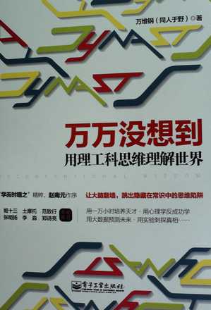

# 《万万没想到》读后感

今天早上读了半本书——《万万没想到》收获颇多，里面众多理论都有证据。其中有一条说道兴趣爱好是先天的。
<ul>
	<li>兴趣爱好来自DNA</li>
	<li>只在“学习区”学习</li>
	<li>针对性小块重复</li>
	<li>有效的反馈</li>
	<li>注意力高度集中（孤注一掷）</li>
</ul>

<!--more-->

<h2>兴趣爱好来自于DNA</h2>
兴趣爱好家境好的可能会受到更好的发展，但是家境稍微不好的会受到抑制，但是这种抑制也是有限的，其总会倾向于对自己爱好的事情发展（个人感觉就像是达不到全局最优，也会朝着这个方向去走）。
文中举了个例子。达尔文的父亲一开始让达尔文学习医学，达尔文修了很多医学方面的课程，但是他后来发现自己对医学不感兴趣，反而对动植物感兴趣，最后不顾父亲的反对，跟着一个类似考察动植物的航海团队去了某个小岛上。最后还是朝着自己兴趣爱好的方向发展。
当然还有讲到关于一万小时的，一定非要一万小时吗？那不一定，不过对那些各行各业的专家进行统计发现（乃至细颗粒时间的观察， 让他们写日记等等）。排除干扰因素，总结一下他们最关键的四点：
<ol>
	<li>只在“学习区”学习；</li>
	<li>把要训练的内容分成有针对性的小块，对每一小块进行重复练习；</li>
	<li>在整个练习过程中，随时获得有效的反馈；</li>
	<li>练习时注意力必须高度集中。</li>
</ol>
这里说到一个故事，总理问老科学家想要提高我国的科学技术水平，应该怎么整？老科学家说应该培养人民群众的内在艺术文化素养。这不瞎扯淡呢嘛？不学好微积分，数学这些，没有基础，基础掌握不好，培养什么所谓的艺术文化素养==。怎么能提高？
<h2>只在“学习区”学习</h2>
每个人都在学习，比方说在Coursera学习一门课，总是挑自己会的，在<strong>“舒适区”</strong>晃荡，永远都是在自己会的圈子里转悠，怎么能提高？人们总是害怕自己不了解没学到或者一知半解的地方——<strong>“恐惧区”</strong>，如果不去<strong>“恐惧区”</strong>学习只在<strong>“舒适区”</strong>，同样的时间花在学习上，你怎么能提高？在两个区域里花的时间都是用来学习的。显然！只在“舒适区”学习打转悠很可能对于你来说提高非常有限，相比在“恐惧器”，呆在“舒适区”的时间越长反而是一种学习时间的浪费。Python的map，reduce，filter会了吗？什么是__slot__等等相关的特殊方法懂了吗？装饰器decorate学懂了吗？是不是还在看简单的？

况且，学习本身就是不容易的！所以在决定去学习的时候呢， 就应该有接受困难的这种心态，要想学的多学得好，就将时间都放在你不懂的地方，将那些搞懂，重复重复重复直到明白，比一直在懂的地方晃荡的收获来得大得不是一星半点。
<h2>针对性小块重复（或者说专题或难点）</h2>
对于一小块重复练习，书中也讲到出色钢琴演奏家的老师让学生练习都是一点一点练习，重复重复重复，而不是演奏整部曲子。对于细节的学习，不仅仅掌握了细碎的知识点，也熟练了这个思路。就好比高考前大量针对性的做专题练习，前面慢慢做，为的是准确，在准确率高了之后再练习为的是提高做题的速度（当然这里以提高考试中做题速度而一味刷题，和平时我们的学习目的是要区别开的）。
<h2>有效的反馈</h2>
关于有效反馈，这里也讲一个故事。对于网络游戏，升级涨经验，打怪掉物品这些都是即时反馈，我们很容易有满足感，因为我们的付出都是即时会看到收益和回报的。但是学习就不一定，有调查显示美国学生有部分没有完成高中学业，是因为经受不住游戏，毒品，聚会的诱惑。

在专业中学习训练也是，你会发现很多已经是世界级运动员了，但还是有教练？教练的水平和其带的世界级的顶级运动员相比，或许大家自然会觉得必然是运动员水平要高于教练，那运动员还需要教练吗这样的疑问。答案是肯定的，因为有了教练我们知道我们的动作哪里不规范，可以得到即时的反馈，你做的不好教练会即时告诉你。

老师存在的目的就在于此。现在MOOC（Massive Open Online Course）教育如雨后出笋（Coursera，edX，Udacity之类，国内imooc等等），但是其无法给出即时的有效反馈，作业都是由计算机判断打分，无法和老师即时交流。这也是在线教育的必然劣势所在，当然今后有望得到改进。
<h2>注意力高度集中</h2>
可能会觉得这里没啥说的，就是提高注意力嘛。其实不然，少有人愿意花一万小时，毕竟刻意的练习不好玩，甚至是痛苦的。

不过我们已知的是如果你有兴趣的话，你会忍受这件事情，甚至是获得快乐，毕竟我们从上面文章内容里知道你想做的事情更偏向于你的兴趣爱好甚至就是，或许你也不清楚当前的事情你是否喜欢，但是如果你感觉还不错的话，我想或许你正朝着你感兴趣的方向走，若不是我想你也会在做当前的事情一阵子后会发现你真正感兴趣的，也说不定呢。

这里摘抄一段书上的内容：
<h4>孤注一掷</h4>
也许很多人认为篮球巨星的最重要素质必然是“热爱篮球”，但在迈克尔乔丹传记《为万世英名而战》（Playing for Keeps）一书中，作者David Halberstam告诉我们，真正使得乔丹成为巨星的“素质”，是对失败的痛恨。为了赢球他可以做任何能提高自己技能的事情，而且这种素质是在被提出校队以后才在他身上标下出来的。有一位教练回忆他第一次看乔丹打球时说：

<strong>当时场上的九个球员都在“例行公事”，而有一个孩子却在全力以赴。看他打得那么拼命，我以为他的球队正以1分落后，而比赛还有两分钟结束。然后我看了一眼记分牌，现在他的球队落后20分，而比赛还剩一分钟。</strong>

乔丹在整个职业生涯都是所有球员中最想赢球的，他总是有极强的目的性，永远都想改进自己的技术弱点。他对赢球是如此渴望，以至于他会骂那些不努力的队友，公牛队的新秀在第一年时往往都会抱怨受不了乔丹的骂。

传统的中国文人非常不喜欢谈论名利，认为做事业最好是为了兴趣，责任感和集体荣誉，甚至最好把从事的运动当成是修身养性的机会。而我们看到的高水平运动员恰恰不是这样。他们上场不是为了跟对方球员交朋友，也不是为了展现自己的体育精神面貌，甚至也不是为了打出赏心悦目的比赛。他们上场是想赢！
