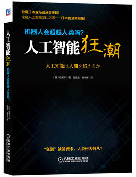

# 《人工智能狂潮》读后感

最近买了不少书：刘知远老师的《大数据智能》，松尾丰老师的《人工智能狂潮》（译者是赵函宏和高华彬，翻译一般，对个别词语翻译不是特别准确，但是并不会影响大众的理解和阅读），还有周志华老师的最近出的机器学习书。这三本书都是前不久新出的。先拿到的是《人工智能狂潮》，还有不到五分之一就读完了。在此，记录一下读这本书的感受。

总的来说，写的非常平实，通俗，易懂（读起来会很快），我个人定位是一本人工智能的科普读物，更适合一些非专业人士来阅读。

整本书的脉络。从机器学习（或说是人工智能更为确切）的发展时间线入手，分别讲了当前的现状（以Google为首的科技公司的发展情况，一些电影，实际中的应用等待以及一些导致失业的悲观情况），人们与专家认识的差距（现在能做什么，不能做什么），以及从时间线的角度讲述人工智能从第一次到当前第四次的浪潮（分别是推理搜索时代，知识时代，机器学习时代，深度学习时代），最后两章则展望了深度学习之后的发展和人工智能对当前社会，人们生活的影响等。

下面，我摘出一些好玩儿的地方作为记录和分享。

[toc]

<!--more-->
<h2>1. 人类危机即将来临</h2>
<em>可以用一个词语来概括人工智能对于人类的威胁，那就是“技术性奇点”，亦被称为“奇点”。其具体内容是：当人工智能进化到足够聪明并且当它能够创造出比自己更为聪明的人工智能时，人工智能的只能将会无限扩大。</em>

<em>低一等级的人工智能创造比自己高一等级的人工智能——当该过程以惊人的速度被无限重复时，人工智能就会出现爆发性的进化。因此，这一瞬间的开始便是世间万物开始出现颠覆的“特异点”。</em>

我想这也是后文中，为什么埃隆 · 马斯克会提出人工智能威胁论乃至设立让人工智能学习一些基本的道义之类的基金会。但是机器人，机器学习的商业化将不会使得人工智能停滞不前，无人机，无人车等产品的出现，可以想象在不久（甚至已经有了），在这样的“玩具”上配备武器就可以远程控制实现对某地的恐怖打击等。
<h2>2. 多层架构深度挖掘</h2>
<em>把它们重叠至无数层，就形成像④那样的塔形。在最下层输入的图像，随着上升抽象度逐渐增加，结果就生成了高层的特征量。这样，如果是“3”的话就逐渐接近“3”这个数字本身的概念。导入的是个别的，具体的，各式各样的“手写数字3”，但是<strong>经过四五次抽象化之后，出现的则是“典型的3”</strong>。无疑，这就是“3的概念”。</em>

<em>一旦计算机能够抓住“典型的3”“典型的5”这些概念，然后告诉它这个叫“3”，这个叫“5”，只需要把概念的名称交给它即可。有监督学习只需要很少量的样本就可以实现。</em>

<em>通过把具有相关性的东西聚合成组来提取特征量，进而在利用这些特征量提取更高层的特征量，然后再提取出用这些高层特征量表示的概念。我们人在平常漫无目的地观赏风景的时候，其实在大脑里面也在进行着如此宏达的处理作业。</em>

这就好比尽管大树有很多分叉，但是我们要得到的是稳定强健的树根，树的主干，需要抓到本质。
<h2>3. 飞跃发展的关键——“鲁棒性”</h2>
其一：

<em>在数据的基础上应该选取什么作为特征表示，这是之前最难解决的难点，深度学习为解决这个难题提供了一线曙光……</em>

<em>但是实际上，深度学习所做的事情，也只不过是将主成分分析进行非线性化，变成多层结构而已。</em>

<em>也就是说，它只是从数据中发现特征量或者概念，然后使用这个聚合块，再去发现更大的聚合块，仅此而已。这没有什么新鲜的，是非常单纯和朴素的想法。</em>

这里拿深度学习和主成分分析作了类比。

其二：

<em>实际上，提取这种特征量或者概念需要相当长时间的“打造和提炼”过程。即像打铁一样，需要通过无数次的煅烧和锤炼使其变得坚韧。只有这样，才能使所获取的特征量或者概念具有“鲁棒性”（也称为“健壮性”）。这个怎样才能做到呢？看起来好像有些矛盾。其实是需要在输入信号里面加入“噪声”。通过反复加入噪声后获取的概念，就不会因为一点风吹草动就摇摆不定。</em>

<em>再回到刚才那个分析日本全国天气的例子，也许可能会出现某县的天气与其他县的天气<strong>偶然性地</strong>连续几天都很一致的情况。其结果，仅仅因为偶然的一致，就会产生“这两个县的天气很相似”的判断。</em>

<em>因此，我们就需要往里面加入噪声，将某地的天气稍微调整一下。……</em>

<em>通过制作大量的这种“也许略有不同的过去”的数据，并使用它们来进行学习，深度学习就能发现“绝对不会出错”的特征量。而且，正因为这些是“绝对不会出错”的特征量，所以还能够进而发现“利用这些特征量生成的更高层特征量”。</em>

<em>使用这种“略微不同的过去”就能解决问题，这个我没有想到。其它的专家也没有想到，得益于每一个抽象化作业都非常牢固可靠。第二段，第三段网上重叠时也能发挥很好地效果。这就好像建造房子一样，如果第一层就摇摇晃晃，那么接着往上建第二层，第三层是不现实的。要建二层或者三层的楼房，无论如何，第一层必须要建得稳固结实才行。</em>

<em>还有，要获取这种不会因为有点风吹草动就摇摆不定的鲁棒性，实际上必须有非常强大的计算能力</em>。

这里不仅说明深度学习模型是 big model ，需要与之相称的 big data 拟合参数，还需要 HPC 。
<h2>4. 第六章末尾注释</h2>
<h3>4.1 导数消亡问题：</h3>
<em>[37]这被称为导数消亡问题（vanishing gradient problem）。最近，大家终于明白不能求解并非是因为这个问题。也有参数数量增加造成局部解增多、容易产生过学习的问题。</em>

更多请参考：
<ul>
	<li>Vanishing gradient problem - Wikipedia, the free encyclopedia
https://en.wikipedia.org/wiki/Vanishing_gradient_problem</li>
	<li>What is the vanishing gradient problem? - Quora
https://www.quora.com/What-is-the-vanishing-gradient-problem</li>
	<li>ReLu(Rectified Linear Units)激活函数
http://www.mamicode.com/info-detail-873243.html</li>
</ul>
<h3>4.2 受限玻尔兹曼机</h3>
这里译者把RBM的缩写写错了（RMB）。

<em>[38]深度学习也不仅限于逐层学习。另外，除了自动编码器以外，也有使用受限玻尔兹曼机（Restricted Boltzmann Machine，RBM）的方法，但是原理几乎相同，因此此处仅对自动编码器进行说明。详细内容请参考人工智能学会杂志的文章连载《Deep Learning（深度学习）》（2013年5月刊至2014年7月刊，共7回）。</em>
<h3>4.3 自动编码器和主成分分析</h3>
<em>[42]自动编码器与主成分分析有几点区别。首先，自动编码器使用的是非线性函数（或者应该说，能够使用任意函数）。其次，第二主成分分析通常由第一主成分的剩余计算而得，因此受第一主成分的影响很大。第三主成分受第一成分的影响很大。由此，到高次主成分就几乎没有实质意义了。</em>
<h3>4.4 关于 Google 猫脸识别</h3>
<em>[43]另外，图像识别等使用得较多的是，令事先加入了合适结构的卷积神经网络进行常规的误差反向传播这种方法，很多时候不使用自动编码器。谷歌猫脸识别研究的预训练，是通过卷积神经网络+自动编码器的方式来完成的。</em>
<h2>5. 对深度学习的两种态度</h2>
<em>其一是认为它只不过是机器学习的发明之一而已，因此仅限于一时流行的可能性比较大。很多机器学习方面的专家持有这种想法。其二是认为，能够获取特征表示，就包含着它可能已经突破了人工智能的本质性极限。持这种观点的人，更多的是置身于比机器学习更为广泛领域的人工智能专家。</em>
<h2>6. 心之所向</h2>
<em>进入大学后……后来我了解到有专门研究人工智能的研究所，于是便整天泡在图书馆学习人工智能的知识。用程序来制造智能，这太有诱惑力了。人工智能已经实现了吗？怀着忐忑不安的心情，我查了相关资料。咦，好像还没有实现呢。“太棒了！”——当得知此消息后，我内心雀跃不已。这么重要的东西还未被探明，还在等着我们去探索和发掘。</em>

<em>这些谜底，我将有机会去揭开吗？我还有机会为本书再写续篇吗？我衷心期盼这些愿望全都能够实现，也暗自鼓舞自己必须为此而不懈努力。</em>

<em>人工智能——虽尚未面世，然我心已向往之。</em>
