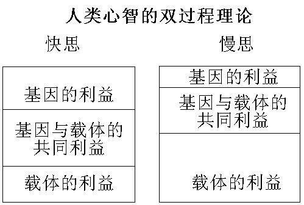

# 《机器人叛乱：在达尔文时代找到意义》读后感

这本书给我的第一感觉是震惊！不单是一种新的思考角度：我们的基因是我们的主人，我们人类只是基因的奴隶（或者说是机器人），我们所做的一切都是在延续我们的基因，因为我们会死掉，但是基因是在不断地繁衍下去的，我们只是基因的媒介，我们是“机器人”。

[toc]

这本书的封面便写着：你是（基因的）载体，是机器人，是不朽的基因和肮脏的模因复制自身的工具。如果《自私的基因》击碎了你的心和尊严，《机器人叛乱》将帮你找回自身存在的价值和意义。《自私的基因》作者理查德 · 道金斯评价此书：我们作为基因机器被制造出来——但是我们有反对我们创造者的能力。我们，孤独地存在于这个星球上，能反对自私的复制子这样的独裁者。<!--more-->

本书就是基于观点一步步思考下去的（也是作者对《自私的基因》的这本书的进一步挖掘，写出作者自己的见解），其实这本书我没有看完，从中间开始就涉及很多心理，哲学等范畴，我读起来晦涩难懂，所幸就此罢休，不看了。但不得不提的是开头那耐人寻味的故事，作者隐晦地用基因比作高高在上的人类，而我们则比作保护人类（实际是保护基因）的机器人。

其实，我很多写的是读后感，感少，多原书摘抄。有的时候觉得自己总结倒不如书中所说的那么好。下面就是对书中部分内容的摘录：
<h1>1. 推荐序 · 一</h1>
<h2>1.1 一段小故事</h2>

>这是《机器人叛乱》这本书的推荐序，尽管如此，故事还是非常耐人寻味的。
时间：2404年。  
还有16年，你即将完成你的使命。你推开窗，看着冬眠医院外渐渐败落的城市。雾霾渐起，你的思绪回到380年前的那天。  
那时，就像那个时代富人常常会做出的选择一样，你的主人决定将自己冬眠起来，一直到400年后。主人们可以“像植物一样活着”，将自己的身体封装在胶囊里面，一动不动，然后任由漫长的岁月腐蚀胶囊。当然，明智的主人们知道，“像植物一样活着”难以帮助自己度过冬眠期间的400年。胶囊的电源断了怎么办？医院被损坏了，需要搬动胶囊怎么办？主人们纷纷决定“像动物一样活着”，就是让机器人们来照顾自己。于是，有了你的诞生。  
你是那一批机器人中毫不起眼、默默无闻的一个。  
主人们制造了你们。你的终极使命就是帮助主人度过400年的冬眠期。为了完成这一终极使命，主人在程序中赋予了你小小的自由—你可以搬动主人胶囊；当封装主人身体的胶囊电源快用完了，你可以采取其他方法去获取电源。  
你就像一条狗一样，你的终极使命就是那条短而有力的狗绳；你的小小的自由就是那条长长的狗绳。当你违反短狗绳的时候，你会遭遇强有力的牵拉，将你扳回继续照顾主人的正轨；当你违反长狗绳的时候，你遭受扳回力度则轻一些，采取什么样的方式搬动主人胶囊，那是你的自由。  
一年又一年，十年又十年，百年又百年。你与沉默不语的主人胶囊相安无事。闲暇时，你也与其他机器人聊聊八卦、看看新闻、打打游戏。不太妙的是，保存主人胶囊的这座城市日益败坏。是污染，是战争，更是人性的贪婪。幸好，冬眠医院设计伊始考虑得足够多，所以，你与机器人同伴们度过了一次又一次危机。  
终于，漫长的400年度过了384年。你遇到了一个棘手、难以解决的问题。你的身体日益腐朽，岁月锈蚀了你当初的机灵；保存主人身体的胶囊的电源也快用完，一次又一次报警。最多，只能再坚持3天。你该怎么办？  
你有两个选择。一个选择是其他机器人遇到类似情况，采取的“A策略”。A策略就是将自己卖掉，然后委托其他机器人帮你照顾主人，度过剩余的16年。卖掉你这一堆破铜烂铁，获得的电源足以支撑主人跑到终点。  
当我们将机器人看作机器人，当我们还记得“完成使命”那条短狗绳在过去岁月中一次又一次的牵拉，我们会选择A策略。  
然而，短狗绳也同样受到了岁月的腐蚀。于是，有了“B策略”。B策略就是将主人的电源拔掉，给自己充电。在400年刚开始的时候，你想都不敢这么想，因为每次这种想法一产生，就会遭遇那条短狗绳狠狠的惩罚。机器人三定律已经深深地写在你的中央控制系统中。  
但是，这已经不是400年刚开始的时候了，这是最后的16年了。于是，你选择了“B策略”。而这，就是你的主人曾经做过的选择。  
在那漫长的演化历程中，你的主人—人类就是那个机器人，而基因则是人类的主人。  
越在进化早期，基因的利益对生物影响就像一条短狗绳那样致命；随着漫长的时间演化，在进化后期，生物体本身的利益逐步背叛了基因的利益。人，是机器人；人，背叛了自己的主人—基因。这，就是人类心智演化史上的“机器人叛乱”。正如真核动物开启了人类进化新篇章；当载体开始背离基因利益—“机器人叛乱”开启了人类心智进化新篇章。  
如果说进化心理学所强调的是基因的利益，“我们带着石器时代的大脑生活在互联网时代”，然而，进化心理学仅代表事情的一面。随着漫长的演化，人作为基因载体自身的利益本身，会与基因的利益发生冲突，最终背叛基因的利益。基因利益、人自身利益的多寡，从而形成了人类心智架构的双进程：快与慢。在快的心智处理进程，我们下意识做出反应，调用的认知资源非常少；在慢的心智处理进程，我们想得多一些，像机器人叛乱一样，去改写主人的使命，调用更多的认知资源。这，就是人类心智的“双过程理论”，如图0-1所示。    
2404年，你违反了机器人三定律，你杀死了你的主人。  
你在主人尸体旁边，静静地望着他，静静地等待你的电源用完。你是机器人，你没有名字。    

<h2 class="entry-title">1.2 人类心智的双过程理论</h2>
在那漫长的演化历程中，你的主人——人类就是那个机器人，而基因则是人类的主人。

越在进化早期，基因的利益对生物影响就像一条短狗绳那样致命；随着漫长的时间演化，在进化后期，生物体本身的利益逐步背叛了基因的利益。人，是机器人；人，背叛了自己的主人——基因。这，就是人类心智演化史上的“机器人叛乱”。正如真核动物开启了人类进化新篇章；当载体开始背离基因利益——“机器人叛乱”开启了人类心智进化新篇章。

如果说进化心理学心理学所强调的是基因的利益，“我们带着石器时代的大脑生活在互联网时代”，然而，进化心理学仅代表事情的一面。随着漫长的演化，人作为基因载体自身的利益本身，会与基因的利益发生冲突，最终背叛基因的利益。基因利益，人自身利益的多寡，从而形成了人类心智架构的双进程：快与慢。在快的心智处理进程，我们下意识做出反应，调用的认知资源非常少；在慢的心智处理进程，我们想得多一些，就像机器人叛乱一样，去改写主人的使命，调用更多的认知资源。这，就是人类心智的“双过程理论”。
<h1>2. 狭义理性和广义理性之剑</h1>
想叛乱，自己得有两把剑。其中一把剑叫狭义理性，简单地说就是正确做事。这把剑能保证你得到自己想要的结果。可是，这些结果真的是你（载体）想要的，还是假扮成你的基因或模因想要的，你不知道。因为你此时不考虑自己的目标和欲望是否合理，只想着用合适的办法实现它。说白了，你只想着正确做事，至于事情本身正确不正确，你不在乎。因此，这些被正确完成的事情，有可能并没有体现你的意志，而是在为基因或模因效劳。

好在除了狭义理性之外，你还有广义理性这把剑。这把剑是要确保你做正确的事，而不仅仅是正确做事。否则，你有可能正确地做了一件对你有害的事。可狭义理性可不管这一点，因为它不在乎目标合理不合理，它只在乎手段是否能实现目的。有了广义理性这把剑，你就不那么容易误入歧途了。

不过，要想拿到这两把剑，尤其是拿到广义理性这把剑，很不容易。我猜，这大概也是为什么斯坦诺维奇要在最后一章花费那么多笔墨的原因所在了。
<h1>3. 模因</h1>
模因是道金斯发明的一个术语，可认为是文化基因。模因是一种能够自我复制的文化片段，可以从一个大脑进入另一个大脑。很多时候，模因对它们的寄主都很好，因此它们被寄主接受，安装在头脑中。这其实也是进化心理学家的普遍看法，即我们大多数的新年都对自己有好处，也正是因为它们对我们有好处，我们才把它们保留在自己的头脑中。可是，在斯坦诺维奇看来，进化心理学忽视了另外一种可能性，即有些模因对我们没好处，自身也不正确，但它们依然能够像病毒一样潜入我们的大脑，原因就在于它们太强大、太狡猾，拥有自我复制的巨大优势。相信自己死后能进天堂的模因，让恐怖分子铤而走险，蹈死不顾。相信一年能治绝症的模因，让很多人把钱源源不断地掏给骗子，即使没有任何疗效也执迷不悟。

不少模因比基因更可怕，更龌龊。基因至少会让载体活到可以繁殖下一代的年纪，可模因就不必对载体这么怜香惜玉，因为它的潜伏期更长。即使一个会让载体万劫不复的模因，它在载体倒霉之前也有无数机会传播自己。可以说，它更冷血，更无情。“洗脑”这个词描述的就是一种被模因感染的载体状态，因为它已丧失了对自己的控制权，彻底变成了模因的傀儡。它做的很多事，或许都对自己没好处，甚至有坏处，可它浑然不觉，因为模因控制了载体，让载体失去了判断力。载体变成了为模因效劳的仆人，一具行尸走肉。
<h1>4. 两种复制子（基因和模因）</h1>
普遍达尔文主义有一个令人震惊、叫人不安的洞见：人类是两种复制子（基因和模因）的寄主，而它们不关心人类的利益，仅仅扮演着复制管道的角色。理查德 · 道金斯总结了20世纪生物学的深刻见解，让我们在惊慌不安中意识到：作为人类的我们自己，事实上不过是基因的生存机器。现代进化科学让我们正确了解生物学，不过，这个学科带有很多不安的寓意。比如，人类被视作巨大的复制子殖民地，这些为数众多的复制子拥挤在笨重的载体中。本质上，人类就是一架复杂的机器，为基因殖民者服务。

同样，我们也是模因（文化的信息单位）的寄主；这是一种破坏人类自主的亚个人实体。跟基因一样，模因也是一种彻头彻尾的自私的复制子。总之，基因包含构造身体的指令，这个身体可携带基因，帮助它们传播自己。总之，模因被用来建立某种文化，这种文化则帮助模因传播自己。模因研究引发的最根本洞见就是，一种观念，<strong>即使不是真的，即使不能以任何方式帮助持有这种观念的人</strong>，也能传播开来。
<h1>5. 人类心智的独特架构特征</h1>
我认为，事实上，人类的独特性来自他们心智的架构特征。这种特征就是高阶表征的倾向。人类，跟其他所有动物都不一样，他们能尝试批判自身的一阶欲望（first-order desire）。这样，跟哲学家哈里 · 法兰克福笔下的玩偶（wanton）相比，人类就成了一种高级存在。要知道，玩偶只会像机器人一样追求他们的一阶欲望。其中，很多都是基因预设的目标，而在人类中，另一些可能就是模因病毒。面对一阶偏好，我们做出二阶评估，这就是所谓的强评估。这么做，我们其实是在问自己是否偏好对某一种结果的偏好。

人类的价值观常常表现为，对我们的一阶偏好进行批判。于是，实现我们一阶偏好跟高阶偏好一致性的奴隶——哲学家罗伯特 · 诺齐克称之为实现理性整合的努力——就成了人类认知的一个独特属性。这种属性能更明确地把人跟动物区别开来。在这一点上，它要胜过其他心理特征，包括意识。意识跟强评估能力不同，它更可能是以连续等级的方式，分布于动物界不同复杂性的大脑中。
<h1>6. 达尔文的进化程序算法</h1>
恰恰是宗教原教旨主义者把事情看得更透彻。而且，恰恰是相信进化论的那批人没看到普遍达尔文主义中存在的危险。这些危险是什么呢？我们首先看一个显而易见的选项：人类通过自然选择进化而来，这就意味着，人类不是上帝或其他任何神灵的特殊设计。它意味着，人类的出现没有任何目的。它还意味着，就生命形式而言，没有任何天生的“高等”或“低等”（见 Gould 1989，1996，2002 ；Sterelny 2001a）。简单地说，一种生命形式跟另一种一样好。

其次，存在一个令人恐惧的问题，进化无意义。这个问题来自一个事实，即进化是一种算法过程（Dennett 1995）。一个算法仅仅是一套形式步骤（即配方），用以解决一个具体问题。我们熟悉一种算法，即计算机程序。进化就是一种在自然界中而不是在计算机上执行的程序。设想有一种最简单的计算机程序，即复制那些在选择过程中存活下来的实体。根据像这种程序一样简单的逻辑，算法式自然选择过程（机械地，盲目地）构造出了像人脑一样复杂的结构（见 Dawkins 1986，1996）。

很多人认为自己相信进化论，可他们没有想清楚这一过程的含义。这一过程是算法式的：机械、盲目、无目的。不过，乔治 · 萧伯纳早在 1921 年就觉察到了这些含义。他写道：“这个理论看起来很简单，因为你最初没有意识到它意味着什么。不过，当你慢慢理解它的整个寓意时，你就会万念俱灰”。它蕴含着一种可怕的宿命论，无论是美丽和智慧，力量和目的，还是荣耀和抱负，都将发生可怕和该死的衰减“。我这里可不是说萧伯纳说得对，仅仅是说，他准确地觉察到达尔文主义对他世界观的威胁。事实上，我并不认为美丽和智慧在达尔文式的观点中就会衰减，而且我会在本书的第８章解释为什么。这里，重要的是，萧伯纳说对了一部分。他聪明地看到了进化的算法式本质。一种算法式过程也许会被描述为宿命论，而且，加之这种算法跟生活有关，于是萧伯纳觉得它狰狞可怕。
<h1>7. 为基因牺牲个体（自己）？</h1>
一只蜜蜂就可能牺牲自己作为载体的自身。比如，蜜蜂可能为了保护跟自己有血缘关系的蜂后，跟外来入侵者殊死搏斗，失去蜂刺而死。有时，基因会为了自身利益而牺牲载体。理解这一情形的寓意，将对我们理解人类的困境产生深远影响：我们是一种进化而来的、具有多重心智的物种。这是因为，正如在下一章中将要讨论的那样，人脑的某些部分执行的是弱约束目标。

蜜蜂的所有目标都是简单而纯粹的基因目标。在它们中，其中一些跟作为载体的蜜蜂的利益相一致，而另一些则不一致，但蜜蜂不知道这一点，也很难说它们在乎。谈到基因，基因目标跟载体目标有多大的重叠不是很重要，问题在于蜜蜂没有自我反思能力，而这种讷讷管理可以对基因利益和相关的载体利益做出区分。

当然，说到人，情况就完全不同了。基因利益跟载体利益具有分离的可能性。对于作为载体、拥有自我反思能力的人类来说，这种可能性影响深远，对于人类而言，把基因利益跟载体利益混为一谈，事实上就是把人看成是蜜蜂。可有时候，在进化心理学文献中，不少学者就是这么做的。它其实排除了这么一种可能性，即人类能意识到载体跟复制子之间的目标冲突，还能想办法来协调相互矛盾的心理输出。

然而，意识到这些潜在的目标冲突需要一个前提，那就是：理解这里谈到的复制子和载体的逻辑，以及它们的含义。对很多人来说，复制子的目标可能跟载体的福祉相冲突，这是一个违反直觉的观点。的确，他们早已习惯这样的观点：进化的运作是为了有机体的利益，而不是为了复制子的利益。复制子跟载体具有不同的含义，理解这种不同有困难。这一点，在道金斯（1982，51）说的一个故事中得到了揭示。他有一个同事，这个同事接受了一个大学生研究项目的申请。这个大学生是一个宗教原教旨主义者，他不相信自然选择的进化，只想研究自然界中的适应器（adaptation）。他认为适应器来自上帝的设计，而且，他只想研究上帝已经制造出来的适应器。但是，道金斯直言不讳地指出，这种立场寸步难行。那个学生陷入了一个令人尴尬的问题中，难以自拔：“上帝发明适应器，谁是受益者？”鲑鱼适应竭尽全力游回它们的产卵地后死去的方式。要是我们认可这样一个非常简单的假设，即对于大多数活着的生物体来说，活着而不是死去能更好地实现自身利益，那么，鲑鱼的这种行为显然不是为了自身利益。要是不掺和耗尽心力的产卵洄游之旅，鲑鱼会活得更久。不过，这种行为的确是服务于鲑鱼基因的繁殖利益。上帝设计这些适应器，是为了活生生的有机体，还是为了它们的基因？生物学的事实很明显，看起来上帝站在后者那一边。……

令人懊恼的是，这个答案来自生物学：人类是生存机器，善于帮助他们自身的基因复制，因此，相互合作构造人体的基因才生存的相当惬意。而且，现在，我们拥有了理解那个无比重要的洞见所需的语言：这是一个令人眩晕的见解。毫无疑问，它是机器人叛乱的第一步。作为载体的人类，破天荒地意识到一个惊人事实：<strong>要是符合自身的利益，基因将总是牺牲载体</strong>。人类独一无二，他们有能力面对这种令人震惊的事实。
<h1>8. 跟自己作战的大脑——大脑中忽视我们的那一部分</h1>
自发式系统帮助把自我从世界中区分出来。它们自动运行，有时会跟你所知道的这个世界的知识相悖。比如，罗津、米尔曼和内梅洛夫（1986；也见 Rozin and Fallon 1987）做了一个跟厌恶情绪有关的实验。在其中一个场景中，参与者吃了一块高级软糖，他们表示还想再吃一块。不过，这时实验者提供了另一块同样的软糖，但是把软糖形状做成了狗屎样。参与者觉得很恶心，一点儿也没胃口了。他们也知道软糖其实不是狗屎，而且闻起来很香，可他们的厌恶反应依然发生了。

丹尼特（1991，414）描述了另一个版本的罗津实验，虽然是非正式的。实验如下。把你嘴里的唾沫咽下去。没问题。好，现在找一个空瓶子，把唾液吐进去，然后把它一饮而尽。呀！太恶心了！不过，为什么？正如丹尼特（1991）指出的那样，“看起来这跟我们的感知有关：一旦某物脱离了你的身体，它就不再是我们身体的一部分，它变得陌生，令人怀疑；它已经放弃了自己的公民身份，变成了要被断然拒绝的另一个东西”（414）。在某种意义上，我们知道。我们对吞咽和对喝的反应截然不同，这是非理性的，可是这也不能取消两种反应之间的差别。知道得再多，了解得再深，都不足以克服面对瓶中唾液时的自发式反应。它同样也是大脑中忽视我们的那一部分。
<h1>9. 自发式和分析式系统</h1>
在《意识的解释》这本书中，丹尼尔 · 丹尼特提出这样一种观点：分析式加工靠一系列虚拟机执行，而虚拟机是由很多平行的大脑硬件虚拟出来的。虚拟机就是运行在电子计算机上的一套指令（“一个虚拟机就是一套暂时的、高度结构化的规则，这套规则则由一个基于硬件的程序启动……这样就能给硬件一套巨大的、环环相扣的、做出反应的习惯或倾向”，丹尼特 1991，216）。简而言之，分析式系统在这种视角下更接近软件（某些人称之为“心智套件”；见 Clark 2001；Perkins 1995），而不是一套独立的硬件架构。

丹尼特（1991）的模型跟一个观点有关系；这个观点在认知科学文献中反复多次出现。它认为，在某种程度上，领域特殊性的自发式模块输出能被用作更为一般的目的，因而增加了行为的灵活性。不过，分析式系统的串行功能难以维持，因为它们是在更适合模式识别这种并行功能的硬件上模拟出来的。”

这样一种看待自发式和分析式系统差异的观点，跟长期以来人工智能领域中的反讽是一致的：人类擅长做的事，比如面孔识别、三维物体感知、语言理解，对计算机来说很难；而计算机很容易做的事，比如使用逻辑、概率推理，对人类来说就很难。现在，研究者对自发式和分析式系统之间为何不同的理解，把这种人工智能领域的悖论给理清了。对计算机来说，它没有建立起经历数百万年进化而成的精细严密的自发式系统。于是，作为一种进化遗产，诸多平行而有效的人类自发式系统擅长的事，对计算机来说简直是难于登天。相比之下，作为一种用于逻辑的串行处理器，人类的分析式系统是一种最近才安装的大脑软件。打一个比方，它就像是一台组装机（在计算机科学中，这是一种解决问题的粗糙方案）运行在诸多平行的、为别的目的而设计的硬件上。相反，计算机最初就是有意设计的串行处理器，依据逻辑规则而运行（Dennett 1991， 212-214）。怪不得，逻辑运算对计算机很容易，但对我们很难，
